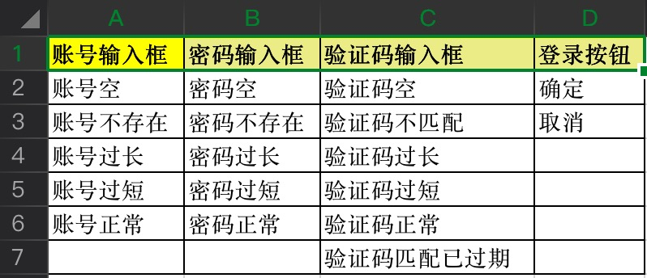
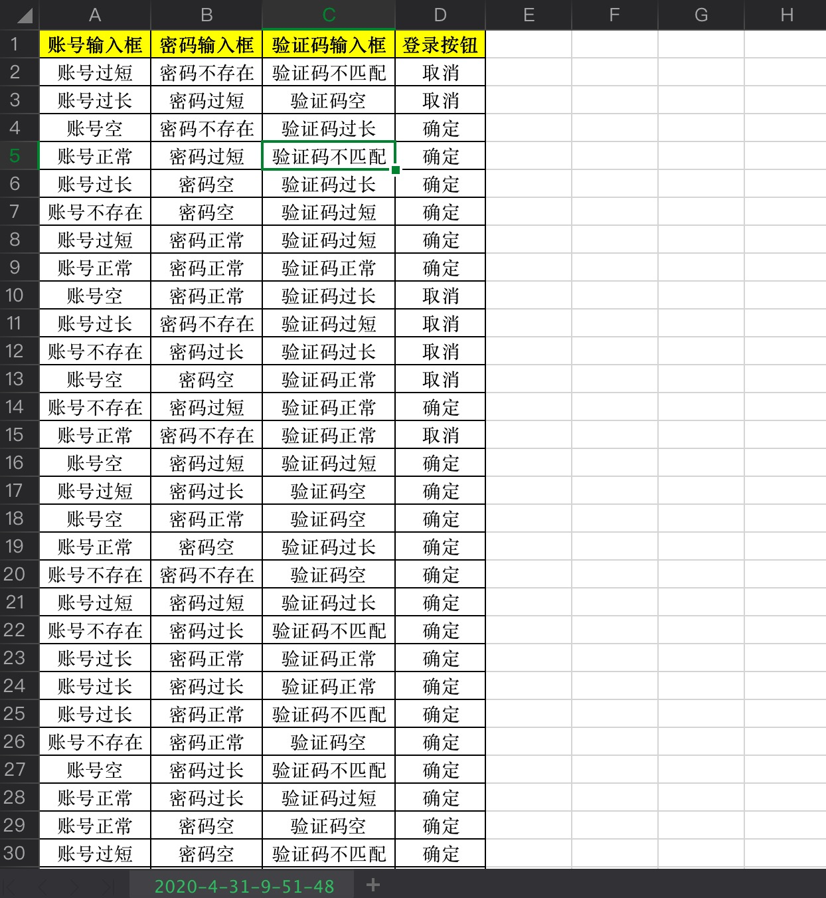
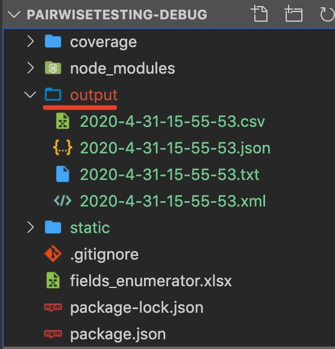
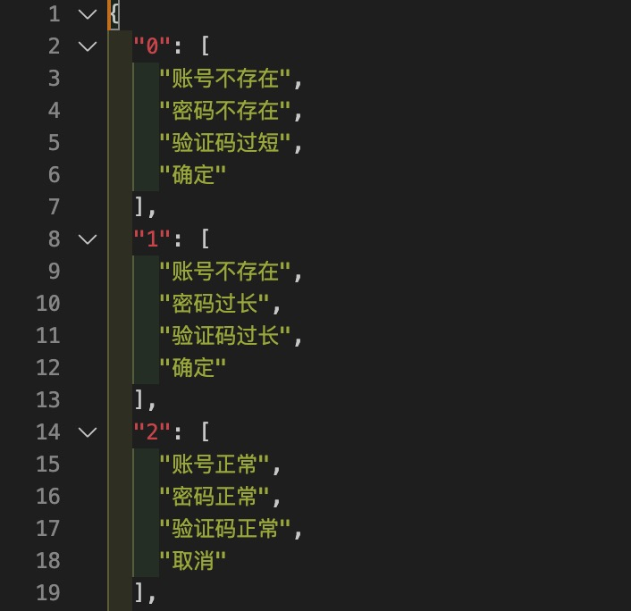
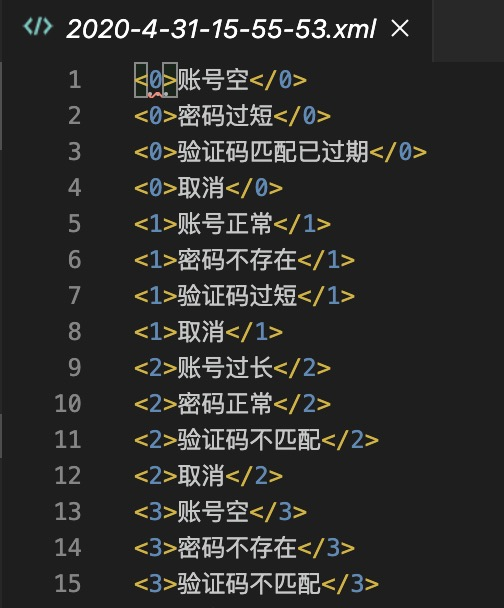

# 成对测试 （PairwiseTesting）


recommend: [China-Gitee](https://gitee.com/liyinchi/PairwiseTesting)，[Other-Github](https://github.com/Musule/PairwiseTesting)


自动组合生成`测试用例场景`，帮助提升`用例测试覆盖率`！

`PairwiseTesting`，又称 `结对测试、两两测试`，是一种正交分析的测试方法。

`以往：` 设计测试用例时，覆盖至少要求任意两个字段（输入条件）的所有水平组合，至少要被覆盖1次。如果多个字段的枚举值组合，人工计算时间成本很大。

`现在：` PairwiseTesting 让你节省时间 `无需人工计算`，自动实现`测试用例`成对组合覆盖


[中文文档]('README.md')

[English Document]('README-en.md')

# 示例
## 用例字段（枚举值）



## 用例组合结果



# 使用
## 1.环境

（1）Nodejs
如果你电脑还未安装配置nodejs环境，请参考：https://www.runoob.com/nodejs/nodejs-install-setup.html

下载Nodejs

>https://npm.taobao.org/mirrors/node/v0.12.13/

（建议版本使用v12.13.0 小于v15.0）

>如果已安装配置nodejs，可跳过此步骤


（2）安装

命令行执行
```bash
npm install
```

## 2.使用

### （1）打开excel表 `fields_enumerator.xlsx`，写入你的用例字段、枚举值


### （2）开始生成

命令行执行
```bash
mocha
```
#### (3) 结果输出

|文件类型|文件名称|
|---|---|
|csv|2020-4-31-9-51-48.csv|
|txt|2020-4-31-9-51-48.txt|
|json|2020-4-31-9-51-48.json|
|xml|2020-4-31-9-51-48.xml|

>output文件夹下




#### csv


#### txt

例如：2020-4-30-22-39-54.txt

```javascript
账号正常,密码过短,验证码正常,取消
账号正常,密码过长,验证码空,确定
账号空,密码正常,验证码过短,确定
账号不存在,密码不存在,验证码过短,取消
账号过长,密码过长,验证码正常,取消
账号正常,密码空,验证码过短,确定
账号不存在,密码过短,验证码空,取消
账号空,密码过长,验证码过长,取消
账号过长,密码过短,验证码过长,确定
账号空,密码空,验证码不匹配,取消
账号不存在,密码过长,验证码过长,确定
账号过短,密码不存在,验证码正常,确定
账号过长,密码空,验证码不匹配,确定
账号过短,密码过长,验证码过短,取消
账号过短,密码不存在,验证码不匹配,确定
账号空,密码过短,验证码不匹配,确定
账号过长,密码空,验证码空,确定
账号过短,密码过短,验证码过短,确定
账号过短,密码不存在,验证码过长,确定
账号正常,密码正常,验证码过长,取消
账号正常,密码过长,验证码不匹配,确定
账号过长,密码不存在,验证码过短,确定
账号空,密码不存在,验证码正常,确定
账号不存在,密码空,验证码正常,确定
账号过短,密码空,验证码过长,确定
账号过长,密码正常,验证码正常,确定
账号正常,密码不存在,验证码空,确定
账号空,密码空,验证码空,确定
账号过短,密码正常,验证码空,确定
账号不存在,密码不存在,验证码正常,取消
账号不存在,密码正常,验证码不匹配,确定

```

#### json



#### xml




#### 控制台
```javascript
  [ '账号过短', '密码正常', '验证码空', '取消' ],
  [ '账号空', '密码正常', '验证码过长', '取消' ],
  [ '账号正常', '密码不存在', '验证码正常', '确定' ],
  [ '账号不存在', '密码空', '验证码不匹配', '取消' ],
  [ '账号过短', '密码过短', '验证码不匹配', '确定' ],
  [ '账号空', '密码过长', '验证码不匹配', '确定' ],
  [ '账号过短', '密码空', '验证码空', '确定' ],
  [ '账号过短', '密码正常', '验证码正常', '取消' ],
  [ '账号正常', '密码不存在', '验证码过长', '取消' ],
  [ '账号过短', '密码不存在', '验证码过短', '取消' ],
  [ '账号不存在', '密码空', '验证码过长', '确定' ],
  [ '账号过短', '密码过长', '验证码过短', '确定' ],
  [ '账号正常', '密码过长', '验证码不匹配', '取消' ],
  [ '账号不存在', '密码过短', '验证码正常', '取消' ],
  [ '账号空', '密码空', '验证码正常', '确定' ],
  [ '账号过长', '密码不存在', '验证码不匹配', '取消' ],
  [ '账号过长', '密码过长', '验证码正常', '确定' ],
  [ '账号不存在', '密码正常', '验证码空', '确定' ],
  [ '账号过长', '密码过短', '验证码空', '确定' ],
  [ '账号不存在', '密码过短', '验证码过短', '确定' ],
  [ '账号正常', '密码空', '验证码过短', '确定' ],
  [ '账号过长', '密码正常', '验证码过短', '确定' ],
  [ '账号正常', '密码正常', '验证码不匹配', '确定' ],
  [ '账号过短', '密码过短', '验证码过长', '确定' ],
  [ '账号过长', '密码空', '验证码过长', '确定' ],
  [ '账号正常', '密码过短', '验证码空', '确定' ],
  [ '账号空', '密码不存在', '验证码过短', '确定' ],
  [ '账号不存在', '密码过长', '验证码过长', '确定' ],
  [ '账号空', '密码过短', '验证码空', '确定' ],
  [ '账号不存在', '密码不存在', '验证码空', '确定' ],
  [ '账号空', '密码过长', '验证码空', '确定' ] 
```
